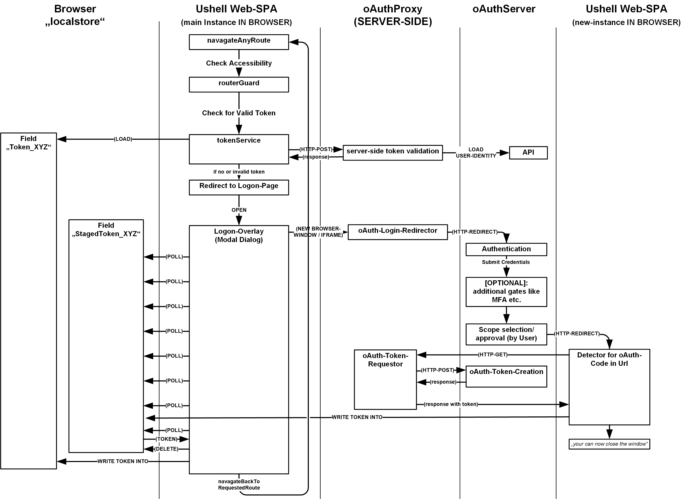

# About the 'Project UShell'

This is the idea of building a 'universal' shell in the form of an SPA that can host any web application. The current paradigm of configurable application modules (keyword 'composite application') in combination with the "WebComponents" standard enables us to create a product which is put together from several decentrally hosted components. In addition, an interaction between these modules should be made possible. In addition, it should also be possible to define various standard use cases, such as processing a list of data records in the form of simple CRUD operations, purely configuratively (see the [CORE-CONCEPT](https://github.com/ProjectUShell/UShell.Docs/blob/master/core-idea-kornsw.md)). In the latter case, no frontend development is necessary at all - only a web service in the backend...

# About this Repo

The 'OAuthProxy' is a component, which is placed on SERVER-SIDE and is does some things, that we don't want to be done directly by the SPA!

## It solves 2 Problems:

1. if we are doing OAuth-logons with the SPA frontend, then we need pass a so called 'client-secret' to the OAuth-server. This secret should not be hard-coded within the frontend SPA to protect it from being stolen.

2. if the OAuth ''[CIBA-Flow](https://openid.net/specs/openid-client-initiated-backchannel-authentication-core-1_0.html)' is ending at the point where the concrete token is retrieved from the OAuth-server via HTTP-post, a JS-application can get various problems related to the [CORS](https://de.wikipedia.org/wiki/Cross-Origin_Resource_Sharing) concern.

## Solution in Detail:

If the post is executions by a PHP-Proxy, then the **'client-secret' never leaves the server** and the SPA **don't need to do cross-site HTTP-Posts**!

We also want to stay **almost compatible the the original OAuth-Calls**, so that a client an either use the proxy OR direct an oAuth-Server. For the validation, the Proxy should be compliant with the specification of a ['token-introspection-endpoint'](https://www.oauth.com/oauth2-servers/token-introspection-endpoint/).

A PHP-based prototype for such a component is growing here!

*WARNING: its just a PROTOTYPE - use under your own Risk and only for non-prod environments!*